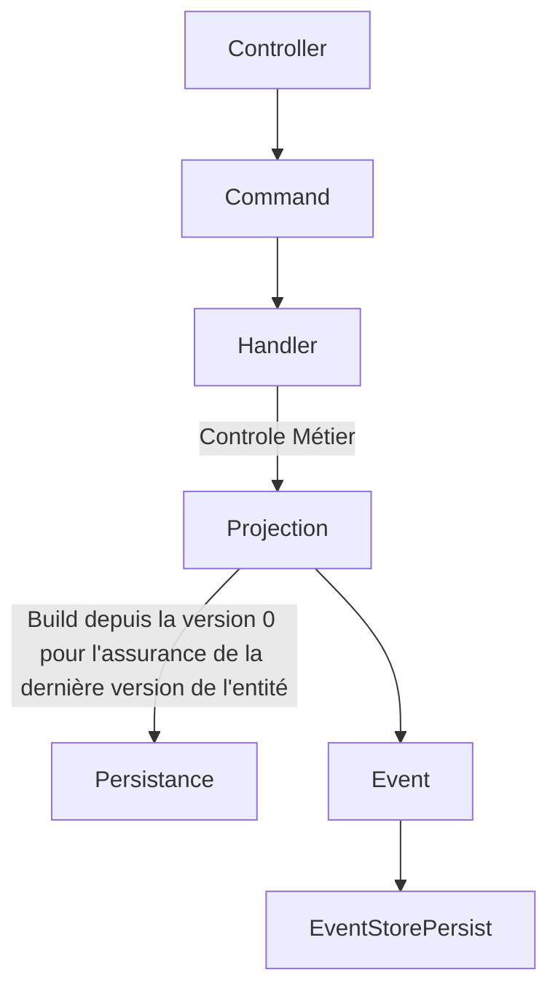

# DomainDrivenDesignTest

Malgré le fait que j'ai de l'expérience en DDD, je n'en ai cependant aucunes sur le pattern de l'event sourcing.

La recherche a été très intéressante mais l'exécution a été assez chaotique en vue du manque de modèles.

Je n'ai pas pu finaliser et rendre ce mini projet fonctionnel dans le temps imparti que je me suis fixé.

Mais j'espère néanmoins que tout ce que j'ai produit n'est pas à jeter.

Je n'ai pas implémenté la persistence mais à l'aide des interfaces, vous pourrez quand même vous faire une idée du fonctionnement.

Dans ce que j'ai compris, le workflow des mutations de données :

J'ai rédigé des tests mais n'ayant pas la parti persistance et donc pas de fixtures, ils ne sont pas executables.

Enfin, je n'ai pas eu l'occasion de faire des commits atomiques, je ne savais pas vraiment par où commencer et j'ai opté pour produire un maximum de choses.
